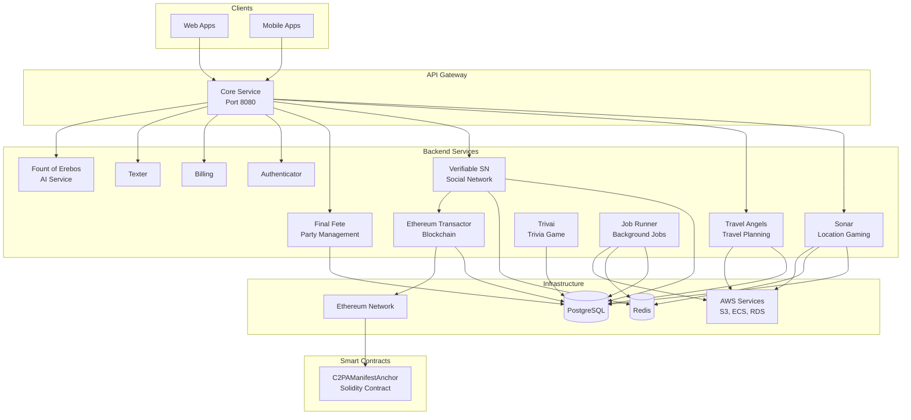

# Poltergeist

A comprehensive monorepo containing interconnected side projects including microservices, web applications, mobile apps, and blockchain integrations. This repository serves as a unified development environment for multiple applications sharing common infrastructure, authentication, and data models.

## Table of Contents

- [Introduction](#introduction)
- [Architecture Overview](#architecture-overview)
- [Tech Stack](#tech-stack)
- [Project Structure](#project-structure)
- [Services](#services)
- [Shared Packages](#shared-packages)
- [Setup Instructions](#setup-instructions)
- [Development Workflow](#development-workflow)
- [Deployment](#deployment)
- [Key Features](#key-features)
- [Database Schema](#database-schema)
- [API Documentation](#api-documentation)

## Introduction

Poltergeist is a monorepo that houses multiple interconnected applications and services. The architecture follows a microservices pattern with shared infrastructure, allowing for rapid development and deployment of new features across different projects.

### Key Features

- **Certificate-based Authentication**: X.509 certificate enrollment with blockchain anchoring via C2PA manifests
- **Location-based Gaming**: Quest generation, treasure hunting, and location-based interactions
- **AI-Powered Content**: LLM integration for quest generation, image processing, and content creation
- **Social Networking**: User profiles, friend systems, and social feeds
- **Travel Planning**: Document management with Google Drive and Dropbox integration
- **Real-time Features**: Redis-based job queues and WebSocket support
- **Blockchain Integration**: Ethereum smart contracts for manifest anchoring

## Architecture Overview

The Poltergeist architecture consists of multiple microservices communicating through a central API gateway (`core`), with shared infrastructure including PostgreSQL, Redis, and AWS services.



### Service Communication

- **Core Service**: Acts as an API gateway, routing requests to appropriate services and proxying to standalone services
- **Shared Database**: All services share a common PostgreSQL database with service-specific tables
- **Redis**: Used for job queues (Asynq), caching, and real-time features
- **Internal Communication**: Services communicate via HTTP/REST APIs
- **Blockchain**: Ethereum transactions are handled through the `ethereum-transactor` service

## Tech Stack

### Backend
- **Language**: Go 1.24.0
- **Framework**: Gin (HTTP web framework)
- **Database**: PostgreSQL 14+
- **Cache/Queue**: Redis with Asynq
- **ORM**: GORM

### Frontend
- **Framework**: React with TypeScript
- **Build Tool**: Vite
- **State Management**: React Context API
- **UI Libraries**: Custom components and hooks

### Mobile
- **Framework**: Flutter/Dart
- **Platforms**: iOS and Android

### Blockchain
- **Language**: Solidity 0.8.20
- **Tooling**: Foundry (Forge, Cast, Anvil)
- **Network**: Ethereum (configurable chain ID)

### Infrastructure
- **Cloud Provider**: AWS
- **Compute**: ECS (Elastic Container Service)
- **Database**: RDS (PostgreSQL)
- **Cache**: ElastiCache (Redis)
- **Storage**: S3
- **IaC**: Terraform
- **Containerization**: Docker

### Development Tools
- **Package Management**: Go modules, npm/yarn
- **Build System**: Make
- **Version Control**: Git
- **CI/CD**: GitHub Actions (for smart contracts)

## Project Structure

```
poltergeist/
├── go/                          # Backend services and packages
│   ├── core/                    # Main API gateway service
│   ├── sonar/                   # Location-based gaming service
│   ├── travel-angels/         # Travel planning service
│   ├── verifiable-sn/          # Social network service
│   ├── final-fete/              # Party management service
│   ├── trivai/                  # Trivia game service
│   ├── job-runner/              # Background job processor
│   ├── ethereum-transactor/     # Blockchain transaction service
│   ├── authenticator/           # Authentication service
│   ├── billing/                 # Billing service
│   ├── texter/                  # SMS service
│   ├── scorekeeper/             # Scoring service
│   ├── fount-of-erebos/         # AI consultation service
│   ├── proteus/                 # Image processing service
│   ├── migrate/                 # Database migrations
│   └── pkg/                     # Shared Go packages
│       ├── auth/                # Authentication client
│       ├── db/                  # Database client and models
│       ├── aws/                 # AWS SDK wrapper
│       ├── ethereum/            # Ethereum client
│       ├── cert/                # X.509 certificate management
│       └── ...                  # Other shared packages
├── js/packages/                 # Frontend applications and libraries
│   ├── sonar/                   # Sonar web application
│   ├── final-fete/              # Final Fete web application
│   ├── guess-how-many/          # Guessing game web app
│   ├── ucs-admin-ui/            # Admin dashboard
│   ├── api-client/              # Shared API client
│   ├── components/              # Reusable React components
│   ├── contexts/                # React context providers
│   ├── hooks/                   # Custom React hooks
│   ├── types/                   # TypeScript type definitions
│   └── utils/                   # Utility functions
├── dart/                        # Flutter mobile applications
│   ├── skunkworks/              # Skunkworks mobile app
│   └── travel_angels/           # Travel Angels mobile app
├── ethereum/                    # Smart contracts
│   └── verifiable-sn/           # C2PA manifest anchoring contracts
├── terraform/                   # Infrastructure as code
│   ├── ecs.tf                   # ECS service definitions
│   ├── database.tf              # RDS configuration
│   ├── networking.tf            # VPC and networking
│   └── ...                      # Other infrastructure configs
├── deploy/                      # Dockerfiles and deployment configs
│   └── services/                # Service-specific Dockerfiles
├── deps.docker-compose.yml      # Local development dependencies
├── Makefile                     # Build and deployment commands
└── go.work                      # Go workspace configuration
```

## Services

### Backend Services (Go)

#### Core Service
**Port**: 8080  
**Purpose**: Main API gateway that aggregates multiple services and routes requests appropriately.

- Aggregates routes from `sonar`, `travel-angels`, `verifiable-sn`, and `final-fete`
- Proxies requests to standalone services (`fount-of-erebos`, `texter`, `scorekeeper`, `authenticator`, `billing`)
- Handles CORS and cross-service communication
- Located at: `go/core/`

#### Sonar
**Port**: 8082  
**Purpose**: Location-based gaming and quest system with AI-powered content generation.

**Features**:
- Quest generation using AI (Dungeon Master)
- Location-based interactions and treasure hunting
- Character progression and inventory management
- Zone-based reputation system
- Party and team mechanics
- Real-time location tracking

**Key Components**:
- Quest archetypes and node system
- Point of interest management
- Inventory and item effects
- Match and team systems

**Location**: `go/sonar/`

#### Travel Angels
**Port**: 8083  
**Purpose**: Travel planning application with document management.

**Features**:
- Google Drive and Dropbox integration for document storage
- Document parsing and location extraction
- Travel destination tracking
- Community polls and quick decisions
- Credit system for premium features
- Trending destinations calculation

**Location**: `go/travel-angels/`

#### Verifiable SN (Social Network)
**Port**: 8087  
**Purpose**: Social network with certificate-based authentication and blockchain integration.

**Features**:
- X.509 certificate enrollment and management
- Certificate fingerprint registration on Ethereum blockchain
- C2PA manifest anchoring for content authenticity
- Social feed and post management
- Friend system and friend invites
- Media upload with presigned URLs
- User search functionality

**Blockchain Integration**:
- Certificates are registered on-chain via `C2PAManifestAnchor` contract
- Certificates start as inactive and are activated when blockchain transactions confirm
- Uses `ethereum-transactor` service for transaction management

**Location**: `go/verifiable-sn/`

#### Final Fete
**Port**: 8085  
**Purpose**: Party and event management with Philips Hue integration.

**Features**:
- Room-based puzzle games
- Philips Hue light control via OAuth
- Utility closet puzzle system
- Room unlocking mechanics
- Color-based indicator systems

**Location**: `go/final-fete/`

#### Trivai
**Port**: 8086  
**Purpose**: Daily trivia game service.

**Features**:
- Daily "How Many" questions generated via AI
- Email and SMS notifications
- Subscription management
- Answer tracking and statistics
- Billing integration

**Location**: `go/trivai/`

#### Job Runner
**Port**: 9013 (health check)  
**Purpose**: Background job processor using Redis and Asynq.

**Job Types**:
- Quest generation for zones
- Profile picture creation
- Treasure chest seeding
- Trending destinations calculation
- Blockchain transaction status checking
- Certificate activation

**Scheduled Jobs**:
- `@daily`: Queue quest generations
- `@weekly`: Seed treasure chests
- `@every 6h`: Calculate trending destinations
- `@every 5m`: Check blockchain transaction status

**Location**: `go/job-runner/`

#### Ethereum Transactor
**Port**: 8088  
**Purpose**: Blockchain transaction service for Ethereum.

**Features**:
- Transaction creation and signing
- Gas estimation for contract calls
- Nonce management
- Transaction status tracking
- Database-backed transaction history

**Location**: `go/ethereum-transactor/`

#### Other Services
- **Authenticator** (Port 8089): Authentication service
- **Billing** (Port 8022): Payment processing
- **Texter** (Port 8084): SMS/text messaging via Twilio
- **Scorekeeper** (Port 8086): Scoring system
- **Fount of Erebos** (Port 8081): AI consultation service using OpenAI
- **Proteus**: Image processing service

### Frontend Applications (React/TypeScript)

#### Sonar Web App
Location-based gaming interface with map integration, quest tracking, and social features.

**Location**: `js/packages/sonar/`

#### Final Fete Web App
Party management interface with puzzle rooms and Hue light control.

**Location**: `js/packages/final-fete/`

#### Guess How Many
Simple guessing game web application.

**Location**: `js/packages/guess-how-many/`

#### UCS Admin UI
Administrative dashboard for managing the platform.

**Location**: `js/packages/ucs-admin-ui/`

### Mobile Applications (Flutter)

#### Skunkworks
Mobile application (details to be documented).

**Location**: `dart/skunkworks/`

#### Travel Angels
Travel planning mobile application with document management.

**Location**: `dart/travel_angels/`

### Smart Contracts

#### C2PAManifestAnchor
Ethereum smart contract for anchoring C2PA manifest hashes on-chain.

**Features**:
- Certificate registry by fingerprint
- Certificate activation/deactivation
- Manifest hash anchoring
- Immutable attestation records

**Contract Functions**:
- `registerCertificate(bytes32 fingerprint, string issuer, string subject)`: Register a certificate
- `setCertificateStatus(bytes32 fingerprint, bool active)`: Activate/deactivate certificate
- `anchorManifest(bytes32 manifestHash, string manifestUri, string assetId, bytes32 certFingerprint)`: Anchor a manifest

**Location**: `ethereum/verifiable-sn/src/C2PAManifestAnchor.sol`

## Shared Packages

### Go Packages (`go/pkg/`)

#### Core Packages
- **`auth`**: Authentication client for JWT token validation
- **`db`**: Database client, models, and repository interfaces
- **`models`**: Shared data models used across services
- **`middleware`**: HTTP middleware for authentication and CORS

#### Infrastructure Packages
- **`aws`**: AWS SDK wrapper for S3, ECS, and other services
- **`ethereum`**: Ethereum client for RPC calls and transaction management
- **`ethereum_transactor`**: Client for the ethereum-transactor service
- **`http`**: HTTP client utilities

#### Service Integration Packages
- **`cert`**: X.509 certificate generation and management
- **`email`**: Email service integration (SendGrid)
- **`texter`**: SMS service integration (Twilio)
- **`hue`**: Philips Hue API client with OAuth support
- **`googlemaps`**: Google Maps API client
- **`mapbox`**: Mapbox API client
- **`googledrive`**: Google Drive API client with OAuth
- **`dropbox`**: Dropbox API client with OAuth
- **`billing`**: Billing/payment processing client

#### AI & Content Packages
- **`deep_priest`**: LLM/AI integration client
- **`dungeonmaster`**: Quest generation using AI
- **`locationseeder`**: Location data seeding with AI assistance
- **`imagine`**: Image generation API client
- **`useapi`**: UseAPI integration

#### Utility Packages
- **`encoding`**: Encoding utilities (base64url, etc.)
- **`util`**: General utility functions
- **`liveness`**: Liveness checking utilities
- **`jobs`**: Job queue task definitions

### JavaScript Packages (`js/packages/`)

#### Application Packages
- **`api-client`**: Shared API client for backend communication
- **`components`**: Reusable React components (e.g., Logister)
- **`contexts`**: React context providers (auth, API, location, map, etc.)
- **`hooks`**: Custom React hooks (useLocation, useUser, usePlaces, etc.)
- **`types`**: TypeScript type definitions shared across frontend
- **`utils`**: Utility functions (city finding, etc.)

## Setup Instructions

### Prerequisites

- **Docker** & Docker Compose (for local dependencies)
- **Go** 1.24.0+ (with Go modules support)
- **Node.js** 18+ and npm/yarn (for frontend applications)
- **AWS CLI** configured with appropriate credentials
- **Terraform** 1.0+ (for infrastructure deployment)
- **Flutter** SDK (for mobile app development)
- **Foundry** (for smart contract development)

### Local Development Setup

#### 1. Start Dependencies

Start PostgreSQL and Redis using Docker Compose:

```bash
make deps
```

This starts:
- PostgreSQL on port 5432
- Redis on port 6379

#### 2. Database Setup

Run database migrations:

```bash
cd go/migrate
# Follow migration instructions (typically involves running migration tool)
```

#### 3. Environment Variables

Each service requires environment variables. Key variables include:

**Database**:
- `DB_HOST`: Database host (default: localhost)
- `DB_PORT`: Database port (default: 5432)
- `DB_USER`: Database user
- `DB_NAME`: Database name
- `DB_PASSWORD`: Database password

**Redis**:
- `REDIS_URL`: Redis connection URL (default: redis://localhost:6379)

**AWS**:
- AWS credentials via `~/.aws/credentials` or environment variables

**API Keys** (service-specific):
- `OPENAI_API_KEY`: For AI services
- `GOOGLE_MAPS_API_KEY`: For location services
- `TWILIO_ACCOUNT_SID` & `TWILIO_AUTH_TOKEN`: For SMS
- `SENDGRID_API_KEY`: For email
- `MAPBOX_API_KEY`: For map services
- `IMAGINE_API_KEY`: For image generation
- `USE_API_KEY`: For UseAPI integration

**Ethereum/Blockchain**:
- `RPC_URL`: Ethereum RPC endpoint
- `CHAIN_ID`: Ethereum chain ID
- `PRIVATE_KEY`: Ethereum private key (for ethereum-transactor)
- `ETHEREUM_TRANSACTOR_URL`: URL of ethereum-transactor service
- `C2PA_CONTRACT_ADDRESS`: Deployed C2PAManifestAnchor contract address

**Service URLs**:
- `BASE_URL`: Base URL for the API (for OAuth callbacks, etc.)
- `PHONE_NUMBER`: Phone number for SMS services

**OAuth** (service-specific):
- `HUE_CLIENT_ID` & `HUE_CLIENT_SECRET`: For Philips Hue
- `GOOGLE_DRIVE_CLIENT_ID` & `GOOGLE_DRIVE_CLIENT_SECRET`: For Google Drive
- `DROPBOX_CLIENT_ID` & `DROPBOX_CLIENT_SECRET`: For Dropbox

#### 4. Start Backend Services

Each service can be run independently:

```bash
# Core service (API gateway)
cd go/core
go run cmd/server/main.go

# Sonar service
cd go/sonar
go run cmd/server/main.go

# Travel Angels service
cd go/travel-angels
go run cmd/server/main.go

# Verifiable SN service
cd go/verifiable-sn
go run cmd/server/main.go

# Job Runner
cd go/job-runner
go run cmd/runner/main.go

# Ethereum Transactor
cd go/ethereum-transactor
go run cmd/server/main.go
```

#### 5. Start Frontend Applications

```bash
# Sonar web app
cd js/packages/sonar
npm install
npm start

# Final Fete web app
cd js/packages/final-fete
npm install
npm start
```

#### 6. Run Mobile Apps

```bash
# Skunkworks
cd dart/skunkworks
flutter pub get
flutter run

# Travel Angels
cd dart/travel_angels
flutter pub get
flutter run
```

### Smart Contract Development

```bash
cd ethereum/verifiable-sn

# Install dependencies
forge install

# Build contracts
forge build

# Run tests
forge test

# Deploy (example)
forge script script/C2PAManifestAnchor.s.sol:C2PAManifestAnchorScript \
  --rpc-url <your_rpc_url> \
  --private-key <your_private_key> \
  --broadcast
```

## Development Workflow

### Adding a New Service

1. **Create service directory** in `go/`:
   ```
   go/new-service/
   ├── cmd/server/main.go
   ├── internal/
   │   ├── config/
   │   └── server/
   ├── pkg/
   │   └── server.go
   └── go.mod
   ```

2. **Add to Go workspace**: Update `go.work` to include the new service

3. **Create Dockerfile**: Add `deploy/services/new-service/Dockerfile`

4. **Add to Core** (if needed): Update `go/core/cmd/server/main.go` to include the service

5. **Add Makefile targets**: Add build and deployment targets to `Makefile`

### Database Migrations

Migrations are located in `go/migrate/internal/migrations/`:

- Migration files follow the pattern: `NNNNN_description.up.sql`
- Use the migration tool to apply migrations
- Always create corresponding down migrations for rollback

### Code Organization

- **Services**: Self-contained in their directories with `cmd/`, `internal/`, and `pkg/` subdirectories
- **Shared Packages**: Reusable code in `go/pkg/`
- **Models**: Shared data models in `go/pkg/models/`
- **Database Access**: Repository pattern via `go/pkg/db/`

### Testing

- Go services: Use standard Go testing (`go test`)
- Frontend: React Testing Library or similar
- Smart contracts: Foundry tests (`forge test`)

## Deployment

### Infrastructure (Terraform)

Infrastructure is managed via Terraform in the `terraform/` directory:

```bash
cd terraform
terraform init
terraform plan
terraform apply
```

**Key Infrastructure Components**:
- ECS cluster and services
- RDS PostgreSQL database
- ElastiCache Redis cluster
- Application Load Balancer
- ECR repositories for Docker images
- S3 buckets for storage
- Secrets Manager for sensitive configuration

### Building and Pushing Docker Images

Use Makefile targets to build and push images:

```bash
# Build and push a service
make sonar/ecr-push
make core/ecr-push
make verifiable-sn/ecr-push
# etc.
```

### ECS Deployment

Services are deployed to AWS ECS. The `core` service aggregates multiple services:

```bash
# Force new deployment
make deploy-all
```

Or deploy individual services via AWS CLI or Terraform.

### Environment Configuration

Production configuration is managed via:
- AWS Secrets Manager (for sensitive values)
- ECS task definitions (for environment variables)
- Terraform variables (for infrastructure configuration)

## Key Features

### Certificate-Based Authentication with Blockchain

The `verifiable-sn` service implements a unique authentication system:

1. **Certificate Enrollment**: Users enroll X.509 certificates by providing a public key and proof of possession
2. **Blockchain Registration**: Certificate fingerprints are registered on Ethereum via the `C2PAManifestAnchor` contract
3. **Activation Flow**: Certificates start as inactive and are automatically activated when blockchain transactions confirm
4. **C2PA Integration**: Supports C2PA manifest anchoring for content authenticity verification

### Location-Based Gaming

The `sonar` service provides:

- **Quest System**: AI-generated quests based on location archetypes
- **Point of Interest Management**: Location-based interactions and challenges
- **Treasure Hunting**: Randomized treasure chests at locations
- **Zone Reputation**: Location-based reputation and progression
- **Party Mechanics**: Team-based gameplay

### AI-Powered Content Generation

Multiple services leverage AI:

- **Quest Generation**: `dungeonmaster` package generates location-based quests
- **Image Processing**: AI-powered image analysis and generation
- **Content Seeding**: `locationseeder` uses AI to enrich location data
- **Trivia Questions**: `trivai` generates daily questions via AI

### Social Networking

The `verifiable-sn` service includes:

- User profiles and authentication
- Social feed with posts
- Friend system with invites
- Media upload and management
- User search

### Travel Planning

The `travel-angels` service offers:

- Document management via Google Drive and Dropbox
- Automatic location extraction from documents
- Travel destination tracking
- Community features (polls, quick decisions)
- Credit-based premium features

## Database Schema

### Core Tables

The database schema is managed through migrations in `go/migrate/internal/migrations/`. Key tables include:

- **`users`**: User accounts and profiles
- **`user_certificates`**: X.509 certificates with blockchain status
- **`blockchain_transactions`**: Ethereum transaction tracking
- **`posts`**: Social media posts
- **`friends`** & **`friend_invites`**: Friend relationships
- **`zones`**: Geographic zones for gaming
- **`quest_archetypes`**: Quest templates
- **`points_of_interest`**: Location data
- **`documents`**: Travel documents
- **`fete_rooms`**: Party/puzzle rooms
- **`treasure_chests`**: Location-based rewards

### Migration System

- Migrations are numbered sequentially: `NNNNN_description.up.sql`
- Each migration should have a corresponding down migration
- Migrations are applied in order
- Use the migration tool to apply/rollback migrations

## API Documentation

### Core API Gateway

The core service runs on port 8080 and routes to various services:

- `/sonar/*` → Sonar service
- `/travel-angels/*` → Travel Angels service
- `/verifiable-sn/*` → Verifiable SN service
- `/final-fete/*` → Final Fete service
- `/texter/*` → Texter service (proxied)
- `/scorekeeper/*` → Scorekeeper service (proxied)
- `/authenticator/*` → Authenticator service (proxied)
- `/billing/*` → Billing service (proxied)
- `/admin/*` → Admin dashboard (proxied)
- `/consult` → Fount of Erebos AI service (proxied)

### Authentication

Most services use JWT-based authentication via the `auth` package:

1. User authenticates via `/authenticator/login` or service-specific login endpoint
2. Receives JWT token
3. Includes token in `Authorization` header for subsequent requests
4. Services validate tokens via the `auth` client

### Service-Specific Endpoints

#### Verifiable SN (`/verifiable-sn/`)
- `POST /verifiable-sn/certificate/enroll`: Enroll a new certificate
- `GET /verifiable-sn/certificate/check`: Check if user has certificate
- `GET /verifiable-sn/certificate`: Get user's certificate
- `POST /verifiable-sn/posts`: Create a post
- `GET /verifiable-sn/posts/feed`: Get social feed
- `GET /verifiable-sn/friends`: Get friends list
- `POST /verifiable-sn/friend-invites/create`: Create friend invite

#### Sonar (`/sonar/`)
- Location and quest-related endpoints
- Party and team management
- Inventory and character progression

#### Travel Angels (`/travel-angels/`)
- Document management endpoints
- Google Drive and Dropbox OAuth
- Location and destination tracking

## Contributing

This is a personal monorepo for side projects. If you're contributing:

1. Follow Go code style guidelines
2. Use meaningful commit messages
3. Test your changes locally
4. Update documentation as needed
5. Ensure migrations are reversible

## License

This repository contains personal side projects. See individual service directories for specific license information.

## Acknowledgments

- **Foundry**: Ethereum development toolkit
- **Gin**: Go web framework
- **GORM**: Go ORM
- **Asynq**: Redis-based job queue
- **React**: Frontend framework
- **Flutter**: Mobile framework
- Various API providers (OpenAI, Google, Twilio, etc.)
